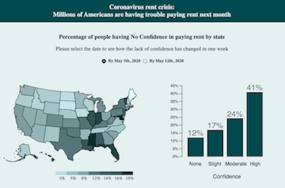

# Coronavirus rent crisis

  
 
 ### About 
 
  Coronavirus is the most important event of 2020 and one of the most important events in history. Millions of people around the world have been sickened and hundreds of thousands of others have died. The entire lifestyle has been changed. As for December 2020, we all still required to wear masks and preferably stay home. 
  
  The most important part for me is what we can learn and how we can get prepared for such a global event like Coronavirus. I decided to look for the available data on the impact of Coronavirus on Americans. I came across the U.S. Census House Hold Survey, which was designed specifically for measuring the impact of Coronavirus on households. The House Hold survey includes many different tables; each of them describes one of these categories: education, employment, housing, food sufficiency, health, social security, spending, and transportation. All of those indicators are important however the first thing we need is shelter over our heads. The loss of employment caused a decrease in household income and, therefore, brought a lack of confidence to pay rent. To explore the percentage and number of people and their lack of confidence during 2020, for my analysis I chose Housing Tables. 
  
  My main goal of this project is to show people that a big percentage of us were not prepared for such an event, which categories were affected the most, and what we can do to prepare ourselves for future events like that. 
 
 ### Data Documentation
 
 * [Data Source](https://www.census.gov/programs-surveys/household-pulse-survey/data.html#phase1)
 * [Census.gov](https://www.census.gov/)
        
 ### Data Mapping
 
My initial plan was to explore the US total number for all weeks at first to see the overall picture of how the confidence of paying rent has been changing throughout these weeks, then to narrow the analysis down to the state total numbers. By the time I started working on my project data collection for the Household Pulse Survey contained two phases. Data collection for Phase 1 began on April 23, 2020, ended on July 21, 2020, and included 12 weekly table releases. Phase 2 of the survey begins on August 19, 2020, and the Census Bureau expects to collect data through October 2020, releasing data every two weeks. Every Data Table contains 50+ sheets. If I would combine all of these weeks, the data set would be too big to work with (at least for me and at least for that moment).

For the first part of the analysis I decided to take US total numbers from all weeks, and for other analysis, to compare the first two weeks of the Household Survey in order to see Americans' "first reaction" to the pandemic. I assumed that the first two weeks would show the level of preparedness better than all other weeks for a few reasons: not all Americans filled up the unemployment benefits application yet; stimulus checks from the government were sending out; I believe that human nature tends to adjust and adapt the environment, so the more people understood how serious the virus situation was, the more of them would find new jobs. I think that the true reaction of Americans to the pandemic was hidden in the first weeks of the survey. The change in total numbers of US supported my suggestion, the percentage of the participants who had "High confidence" in the first week decreased, while the percentage of "No Confidence" and "Slight Confidence" increased. However, the logic of the percentage of "No Confidence" level changing by the state was not that clear. Some of the numbers went up, some went down. To prove my suggestion right or wrong we will need to make more analysis.

### Design Decisions & Main Challenges

The idea of the color palette was taken from [New York State Department of Labor](https://dol.ny.gov/). I liked the variety of dark turquoise color and how its shades merge with white, grey, and black. Later on, I decided to add some more colors since I needed them for a variety of categories. 

  The first chart in my mind was a heatmap because this type of chart can clearly show the relationship between two variables by the change of its values through the color of the cells. It is one of the two charts that I haven’t changed during the process. The heatmap fitted the data perfectly. I used the US total numbers of each week as the x-axis and four levels of confidence as the y-axis. This chart is represented the total numbers of survey participants from May 2020 to October 2020 and their confidence in paying rent next month. 
  
  The second chart is the US map. I think it is the easiest way to show the difference in numbers in all states by color. For another part of the analysis, I wanted to make a barchart with filtering data by state, category, and characteristics. But the structure of the data turned out more complicated than I expected. I have spent hours of cleaning, filtering, and rearranging the data in Excel and Python and still did not fully completed my idea. While exploring the data I realized that every week consists of the US total numbers and every states’ total numbers, which does not let you map those numbers on the same graph because of the huge difference in numbers, neither on the US map because The the US totals cannot be represented at the same time with States totals. Also, the data has a nested structure for the categorical variables and unique values for numerical variables, which brought some challenges as well. So, for my barchart and Scatter plot, I ended up taking US numbers and comparing them in between weeks. 
  
  For the last chart I chose scatter plot where the number of people is represented by the x-axis and by the size of the circle, and the category such as age, education, income and etc. is represented by color. Each category includes a few characteristics. All characteristics are of the same color and different sizes. For now, the user can see which characteristics are which only by hovering over the circles. The size and position of the circles are very different so it was difficult for me to add text over or next to the characteristics. I hope I will find another way.
  
Although the structure of the data did not let some of my ideas come to life I definitely learned a lot through dealing with it. For the second part, I ended up combining two charts: US map and barchart. For each of the two first weeks, the US map shows the percentage of people who had no confidence by state, while barchart shows the percentage of people having all levels of confidence by country. For mapping the data with `.json` file to create a projection I used abbreviations for states, which left aside "US" data points as undefined. That helped me to avoid the problem I was talking about above that US data points are leveled up with States data points.

Even though the idea of changing data and the theme of my project showed up in my head a few times, I do not regret my choice. I have learned how to filter and map the data through the challenges I accepted. And more than that, beautifully visualize it. 

By the end of my article I talk about our responsibility to get prepared for this kind of events. While we can't predict any viruses and rise of unemployment, we can always lear how to take care of ourselves and our family financially. I included a few articles about financial literacy and first steps how to start saving money. 

 * Data Manipulation in Jupyter Notebooks:
 * * [`dataframe`](https://github.com/nchikurova/advanced-studio/blob/master/Data_manipulation_dataframe.ipynb)
 * * [`openpuxl`](https://github.com/nchikurova/advanced-studio/blob/master/Data_openpyxl_new.ipynb)
 * * [`xlrd`](https://github.com/nchikurova/advanced-studio/blob/master/Data_xlrd_new.ipynb)
 
 * [Data Wrangling](https://observablehq.com/d/65408b7a9bd98edd)
 
 * [Data Structure](https://github.com/nchikurova/studio-project/blob/main/data/week_1.csv)
 
 * Data Description:

        "total": total
        "wrent": occupied without rent
        "noconf": no confidence
        "slightconf": slight confidence
        "modconf": moderate confidence
        "highconf": high confidence
        "deferred": payment is/will be deferred
        "didnotrep": did not report
        "didnottenure": did not report to tenture
        
 To continue my analysis, I want to separate US total numbers and state total numbers in my data set, and visualize all four levels of confidence in paying rent next month by state. It also will help me to get to the categories by state. If I had more resources and simply more knowledge in Data Manipulation I would rearrange the data differently and analyze it more precisely. I think I will come back to this project in the future and create the nested `.json` I needed. So far, I am happy and proud of myself that I have tried and I have done my best.
 
  ### Prototypes
 
 * [US Map](https://observablehq.com/@nchikurova/us-map-by-household-median-income-2017)
 * [Heatmap](https://observablehq.com/@nchikurova/heatmap)
 * [Data exploration](https://observablehq.com/@nchikurova/untitled)
 * [Code prototype](https://github.com/nchikurova/studio-project/tree/main/project_state_prototypes)
 
 * [Project Brief - Visual Desk Drfat](https://drive.google.com/file/d/1cAxLVb19tX-V9ysfmJltnS2aD_roqO1O/view?usp=sharing)
 
 ### Stable Links
 
 * [Prerecorded walkthrough](https://drive.google.com/file/d/1Vo47aRRwCOqAlID00kRKO2NfCTfiMmRT/view?usp=sharing)
 
 * [Project link](https://nchikurova.github.io/studio-project/project_global/)
